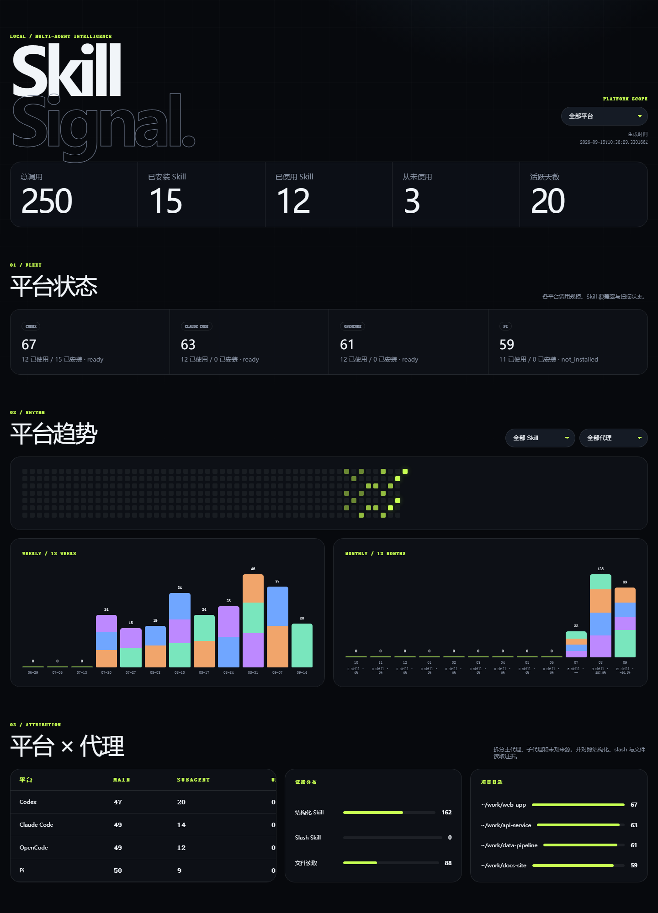

# 多平台 Skill 本机使用分析

本工具在本机汇总 Codex、Claude Code、OpenCode 和 Pi coding agent 的 Skill 调用，写入 SQLite，并生成可离线打开的统一 HTML 仪表盘。支持 Windows、macOS 和 Linux，只使用 Python 标准库，不需要第三方 Python 包、常驻服务或中心服务器。

所有统计默认只保存在当前用户的数据目录，不会上传、同步或共享会话数据。



仪表盘为单个自包含 HTML 文件，可离线打开，不含 CDN 或远程资源。图中为脱敏的演示数据。

## 交给 Agent 安装

仓库自带 `skills/skill-analytics/`，是一个遵循 Agent Skills 规范的技能包。可以让 Agent 读取本仓库地址后自行完成安装，无需手工改配置：

```text
阅读 <repository-url> 中的 skills/skill-analytics/SKILL.md，按其中的步骤为我安装
```

Agent 会按 `SKILL.md` 与 `references/install.md` 判断当前平台、调用下面的安装器、提示宿主信任步骤，并用 `status` 验证。安装细节和各平台差异见 [安装参考](skills/skill-analytics/references/install.md)。

## 最小流程

需要 Python 3.10 或更高版本。在项目根目录运行：

```text
git clone <repository>
cd codex-skill-analytics
python analytics.py scan-all
python analytics.py report
```

数据库和报告默认写入当前用户的数据目录：Windows 为 `%LOCALAPPDATA%\skill-analytics\`，macOS 和 Linux 为 `$XDG_DATA_HOME/skill-analytics/`（或 `~/.local/share/skill-analytics/`）。可用 `SKILL_ANALYTICS_HOME` 覆盖。旧版本留在仓库 `data/` 下的数据库会在首次访问时复制过去一次，原文件保留。

重复执行 `scan-all` 不会重复计数；未安装的平台显示为 `not_installed`，不会阻止其他平台扫描。

报告中的“从未使用”只统计用户可管理的已安装 Skill；Agent 原生 Skill（当前以 `skill_source=system` 标记）会被排除。Skill 排行默认展示前 20 项，可展开全部，并支持按名称模糊搜索；搜索会在当前平台的完整排行中匹配。

自动更新是可选增强，必须显式选择平台：

```text
python analytics.py install --platform codex --platform claude
python analytics.py install --platform opencode --platform pi
```

安装器会先备份再修改配置，重复安装字节不变，并且只删除自己写入的内容。已安装的 Hook 会记录本仓库和 Python 解释器的绝对路径，因此检出位置需要保持固定；移动或重命名仓库后应先卸载再从新位置安装。

Codex 安装后须在 `/hooks` 中检查并信任 Hook；Claude Code 仍受 workspace trust 约束。安装器不会绕过宿主信任机制。

## 支持范围与统计口径

| 平台 | 历史回填 | 可选实时集成 | 高置信度证据 |
| --- | --- | --- | --- |
| Codex | 本地 session JSONL | 异步 `Stop` Hook | 真实命令读取具体 `SKILL.md` |
| Claude Code | transcript JSONL 兼容层 | `PostToolUse`、`UserPromptExpansion` Hook | `Skill` tool、slash command；文件读取仅作回退 |
| OpenCode | 公共 CLI 的 session list/export | Plugin `tool.execute.after` | 成功完成的 `skill` tool |
| Pi coding agent | Session JSONL | Extension `tool_execution_end` | 成功完成的 `read .../SKILL.md` |

一次调用由平台、会话、回合和 Skill 身份共同确定。证据优先级为 `structured_skill > slash_skill > skill_file_read`；同一回合的更高等级证据会升级已有记录，不增加次数。普通文本提及、Skill 清单、工具输出、路径搜索、存在性检查和写入操作不计数。若宿主未把行为写入公共事件、导出或本地会话，本工具无法统计。

## CLI

```text
python analytics.py scan-all
python analytics.py scan --platform <codex|claude|opencode|pi> [--platform ...]
python analytics.py report
python analytics.py status
python analytics.py install --platform <name> [--platform ...]
python analytics.py uninstall --platform <name> [--platform ...]
python analytics.py prune [--older-than <天数>] [--diagnostics-only] [--yes]
python analytics.py compact
```

- `scan-all` 扫描四个平台；单个平台缺失或失败时继续处理其余平台。
- `scan` 只扫描显式平台。
- `report` 生成自包含、无需 CDN 的仪表盘。
- `status` 显示解析路径、扫描/实时更新时间、格式诊断和集成状态。
- `install`、`uninstall` 只处理显式平台；不带 `--platform` 会拒绝执行。
- `prune` 清理历史数据，默认只预览不删除；详见[历史数据清理](#历史数据清理)。
- `compact` 回收已删除数据占用的磁盘空间。

所有统一命令都支持以下路径覆盖项，参数应放在子命令之后：

```text
--codex-home <path>
--claude-home <path>
--opencode-config-dir <path>
--opencode-command <executable>
--pi-home <path>
--pi-session-dir <path>
--db <database-path>
--output <html-path>
```

`record --platform <claude|opencode|pi>` 是实时集成从标准输入写入单个事件的内部入口，通常不手工调用。

原有 Codex 兼容入口继续可用：

```text
python scanner.py backfill
python scanner.py scan <transcript-path>
python report.py [--db <database-path>] [--output <html-path>]
python install_hook.py install
python install_hook.py uninstall
```

这些入口只处理 Codex。精确参数以 `python analytics.py <command> --help` 或对应脚本的 `--help` 为准。

## 路径发现优先级

统一优先级是：

1. 当前命令的显式 CLI 参数；
2. 平台官方环境变量；
3. 平台 settings 中公开支持的路径项；
4. 当前用户目录下的平台默认路径。

`~` 在 Windows、macOS 和 Linux 上都表示当前用户目录；实现使用 `pathlib`，不硬编码用户名或盘符。

| 平台 | 环境变量和默认根目录 | 历史会话与 Skill 位置 |
| --- | --- | --- |
| Codex | `CODEX_HOME`，否则 `~/.codex` | `sessions/**/*.jsonl`；`skills`、`~/.agents/skills`、当前 Plugin cache |
| Claude Code | `CLAUDE_CONFIG_DIR`，否则 `~/.claude` | `projects/**/*.jsonl`（含 `subagents/`）；用户、项目祖先及 Plugin Skills |
| OpenCode | `OPENCODE_CONFIG_DIR`，否则 `~/.config/opencode` | 由 `--opencode-command` 的公共 CLI 导出；全局/项目 `.opencode/skills` 及兼容的 `.claude/skills`、`.agents/skills` |
| Pi | `PI_CODING_AGENT_DIR`，否则 `~/.pi/agent` | session 优先级：CLI → `PI_CODING_AGENT_SESSION_DIR` → `settings.json:sessionDir` → `sessions`；用户/项目及显式 Skill 路径 |

数据库和报告默认位于用户数据目录下的 `analytics.db` 与 `dashboard.html`，可用 `--db`、`--output` 覆盖。

## 自动集成、备份与卸载

| 平台 | 会修改的精确目标 | 卸载行为 |
| --- | --- | --- |
| Codex | `CODEX_HOME/hooks.json`，默认 `~/.codex/hooks.json` | 只移除当前 Python 与仓库路径对应的 `Stop` 定义 |
| Claude Code | `CLAUDE_CONFIG_DIR/settings.json`，默认 `~/.claude/settings.json` | 只移除本工具的两个 Hook matcher group |
| OpenCode | `OPENCODE_CONFIG_DIR/plugins/opencode-skill-analytics.js`，默认 `~/.config/opencode/plugins/opencode-skill-analytics.js` | 只删除生成标识匹配的文件 |
| Pi | `PI_CODING_AGENT_DIR/extensions/pi-skill-analytics.ts`，默认 `~/.pi/agent/extensions/pi-skill-analytics.ts` | 只删除生成标识匹配的文件 |

Codex/Claude JSON 配置发生实际变化前，会在同目录创建 `<文件名>.backup-<时间戳>`，并保留其他字段和 Hook。重复安装字节不变且不重复备份。OpenCode/Pi 目标若已存在但没有本工具生成标识，安装器拒绝覆盖和删除；更新旧的自有生成文件时会先备份。

```text
python analytics.py uninstall --platform codex --platform claude --platform opencode --platform pi
```

卸载不删除数据库、报告或备份。完整恢复 JSON 时应先退出宿主，再人工核对并恢复安装输出指明的备份。

生成配置记录当前 Python 和仓库绝对路径。仓库移动/重命名或 Python 解释器路径变化后，应先卸载再从新位置安装；若旧路径已不存在，按 `status` 显示的精确目标人工移除旧定义，再重新安装。

## 使用 `status` 排查

```text
python analytics.py status
```

- `resolved_root` 应指向实际用户目录；错误时使用 CLI 覆盖或环境变量。
- `ready` 表示已发现且格式受支持；`not_installed` 不是错误；`partial` 表示部分失败；`unsupported_version` 表示格式未知；`integration_error` 表示实时入口失败。
- 检查 `last_history_scan_at`、`last_realtime_at` 是否更新。
- `diagnostics` 只保存来源路径、事件类型与异常摘要，不保存原始提示词或工具输出。
- `integration_status=conflict` 时不要覆盖目标，先确认该文件归属。

OpenCode 失败时确认 `--opencode-command` 可执行；扫描器不会读取其内部数据库。实时数据未更新时，检查集成状态、Codex/Claude 信任以及绝对路径，然后运行 `scan-all` 幂等补齐历史。

## 官方核验与兼容边界

最近核验时，官方站点仍公开本实现使用的 Codex Hooks/Skills、Claude Code Hooks/Skills/Sessions、OpenCode Skills/Plugins/CLI export，以及 Pi Skills/Extensions/Session format/Settings。README 不绑定宿主应用发行版本；官方文档和实现变化时，以链接的当前说明及 `status` 为准。

- **Claude Code 历史**：transcript entry 是不承诺长期稳定的内部结构。历史扫描只接受 fixture 已验证结构；未知 entry 忽略并记录诊断。官方 Hook 是实时主路径，历史层仅为 best-effort 兼容。
- **OpenCode 历史**：官方公开 Plugin 和 session/export CLI，但不公开内部 SQLite schema。本工具不读内部数据库。export JSON 的具体结构仍由 fixture 锁定，未知结构会隔离。
- **Pi 历史**：高置信度边界是官方 Session JSONL v3，以及 fixture 覆盖的无版本旧 header；其他格式版本、自定义发行包或失败的 `read` 不计数。v3 指会话文件格式，不是 Pi 应用发行版本。
- **Codex 历史**：没有独立 SkillUse 事件时，仅把真实读取具体 `SKILL.md` 的命令作为证据。
- **实时完整性**：宿主被强制终止时异步事件可能丢失，下一次 `scan-all` 用于补齐可观察历史。

官方依据：

- [OpenAI Codex Hooks](https://developers.openai.com/codex/hooks) 与 [Codex Skills](https://developers.openai.com/codex/skills)
- [Claude Code Hooks](https://code.claude.com/docs/en/hooks)、[Skills](https://code.claude.com/docs/en/skills)、[Sessions](https://code.claude.com/docs/en/sessions) 与 [Environment variables](https://code.claude.com/docs/en/env-vars)
- [OpenCode Skills](https://opencode.ai/docs/skills/)、[Plugins](https://opencode.ai/docs/plugins/)、[CLI](https://opencode.ai/docs/cli/) 与 [Server API](https://opencode.ai/docs/server/)
- [Pi Session format](https://github.com/badlogic/pi-mono/blob/main/packages/coding-agent/docs/session-format.md)、[Skills](https://github.com/badlogic/pi-mono/blob/main/packages/coding-agent/docs/skills.md)、[Extensions](https://github.com/badlogic/pi-mono/blob/main/packages/coding-agent/docs/extensions.md) 与 [Settings](https://github.com/badlogic/pi-mono/blob/main/packages/coding-agent/docs/settings.md)

官方页面存在不等于历史内部字段都有兼容承诺，因此实现坚持公共接口优先、未知格式隔离，不把当前内部结构写成长期保证。

## 历史数据清理

数据库默认位于用户数据目录，长期使用会缓慢增长。实测约 1300 条调用记录对应 3.4 MB，日常使用多年也通常只有几十 MB，不是必须定期清理的空间占用。

`dashboard.html` 每次生成都会整体覆盖，不随历史累积。真正需要留意的是诊断记录：解析失败时会逐条写入，遇到宿主会话格式变更可能明显增长。

清理是显式操作，不会自动执行，也不会自动删除任何历史。三个命令各司其职：

```text
python analytics.py prune --older-than 90      # 预览：将删除 90 天前的调用记录
python analytics.py prune --older-than 90 --yes # 实际删除
python analytics.py prune --diagnostics-only --yes  # 只清诊断记录
python analytics.py compact                     # 真正释放磁盘空间
```

### 先预览，再删除

`prune` 不加 `--yes` 时只打印将删除多少行，不修改数据库：

```text
python analytics.py prune --older-than 180
```

输出含 `matched`（匹配行数）、`deleted`（实际删除，预览时恒为 0）和 `hint`。确认无误后再加 `--yes`。

### 删除与回收空间是两步

SQLite 删除行后文件不会自动缩小，磁盘空间仍被占用。因此 `prune --yes` 之后需要执行：

```text
python analytics.py compact
```

`compact` 会重建数据库并返回 `reclaimed_bytes`。数据量大时可能耗时数秒，期间不要中断。

### 清理范围与安全边界

- `prune --older-than <天数>` 只删除该天数之前的**调用记录**。
- `--diagnostics-only` 只删除诊断记录，不影响任何统计数字。
- **`installed_skills` 永不删除**：它记录已安装 Skill，否则“从未使用”会算错。
- 两个选项可同时使用，一次删除调用记录和诊断记录。
- 不带任何选择条件时 `prune` 会拒绝执行并返回 `nothing_selected`，避免误删全库。
- 清理同时会移除指向已不存在会话文件的扫描游标。

清理只会让历史变短，不会影响仍在保留范围内的统计口径。若不确定，先只跑预览，或先备份数据库文件。

## 数据与隐私

SQLite 记录平台、会话/回合标识、Skill 名称与可用路径、证据类型、调用时间、工作目录、代理分类、模型和采集来源；不保存提示词、助手正文、工具输出、完整 shell 命令、Skill 内容、令牌或认证文件。

统计、诊断、错误日志和 HTML 默认只保存在本机用户数据目录。工具不含上传、遥测、团队汇总或云同步；HTML 自包含，不加载 CDN 或远程资源。

## 测试

```text
python -m unittest discover -s tests -v
```

测试使用脱敏 fixture、临时数据库和临时用户目录。端到端验收执行 `scan-all → 重复 scan-all → report → install → 模拟实时事件 → report → uninstall`，mock OpenCode 外部 CLI，并由 `TemporaryDirectory` 自动清理测试产物，不接触真实 home/config。

